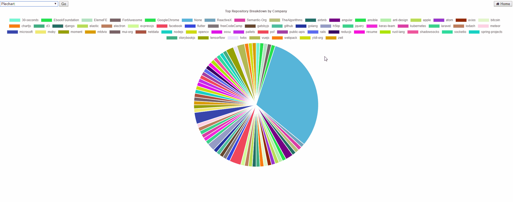

# GithubDataVisualisation

The application runs on localhost:5000 by executing python -m flask run while in the source folder. 

## First Access of Github API
The commit relating to first access of the github API: efc861c76652afacc6b0802f1f129cc7f372268a.

-----------------------------------------------------------------------------
# Overview of Idea
The basic idea is to demonstate the correlation between companies and the languages used using information gained from the top repos and top users on the site.

## Technologies used
Backend - Flask and Python.
Frontend - HTML, Javascript, CSS, and Jinja2 (a templating language).

## Data processing in create_json.py
Step 1:
Through the Github API I get 300 of the top rated Github Repositories by number of stars and 300 of the top users by
number of followers.

Step 2 - Languages:
Dealing with the Repo: I create a json file that has a key being the language and the value being the number of repos that
primarily use that language.

Dealing with the User: This was slightly more difficult to achieve. Again through the Github API I receive a slice of 10 of 
their repos and get the most used language within those 10. I then again create a json file containing key of language 
and value being number of users that most use that language.

Step 3 - Companies:
Using a process similar to the one above, I get the the company affiliated with a repo/user and then the number of other repos/users that associate with that company creating two seperate key value json files. One for user and one for repo.

Step 4 - Combining:
Once I had the four seperate json files I then combined them into two seperate json files one that had the companies combined and then one that had the languages combined. This is so as I am able to provide breakdown further through the use of pie charts.

Step 5 - Correlation:
Using the top repos and top companies I create a json file that contains the company the user/repo is associated with as the key and then the value being the number of times a language is associated with a repo/is the top language for a user. eg. "freeCodeCamp": {"JavaScript": 1}, "facebook": {"JavaScript": 6, "null": 1, "Python": 1}

## Data processing in app.py
Step 1:
Read in the corrCompanyLanguages json file.

Step 2:
I get the top X number of languages by mention in the file and the top X number of companies by language use variety. The default being X = 10. 

Step 3:
Using this information I am able to create the flow matrix showing the flow between company and language. 
Example of flow matrix with 3 values for companies (A, B, C) and 3 values (X, Y, Z) for languages.
  A   B   C   X   Y   Z   
A 0 | 0 | 0 | 3 | 5 | 6   
B 0 | 0 | 0 | 1 | 0 | 7   
C 0 | 0 | 0 | 2 | 8 | 1   
X 3 | 1 | 2 | 0 | 0 | 0   
Y 5 | 0 | 6 | 0 | 0 | 0   
Z 6 | 7 | 1 | 0 | 0 | 0   
 
Flow being -   
A -> X = 3   
A -> Y = 5   
A -> Z = 6   

B -> X = 1   
B -> Y = 0   
B -> Z = 7   

C -> X = 2   
C -> Y = 6   
C -> Z = 1   

Step 4:
I set up the labels associated with the flow matrix and randomly generate a colour to go with the label.

Both arrays are sent to the front end to be dealt with and displayed a combination of Javascript, CSS and HTML.

# Chord Chart Display
Default display of correlation between 10 companies and 10 languages.

# Chord Chart Increased Correlations
Dynamic display of any number of correlations between the numbers of 1 - 30.

# Extra Functionality
Further breakdown provided by piecharts containing information gained through the creation of the chord chart.

